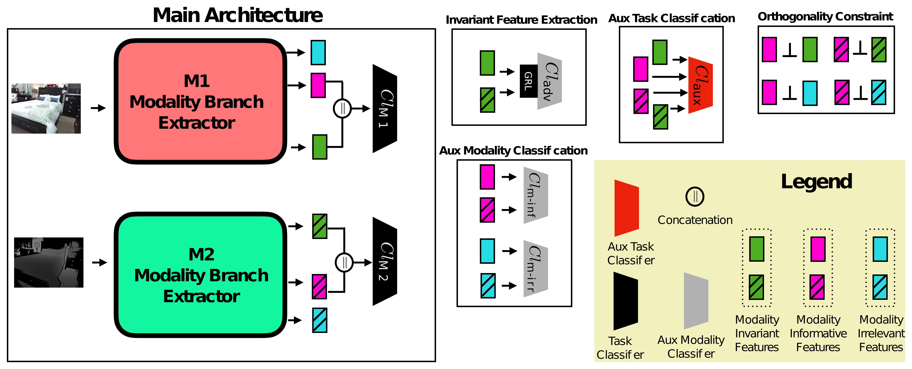

# DisCoM-KD: Cross-Modal Knowledge Distillation via Disentanglement Representation and Adversarial Learning

This repository is associated to the following BMVC 2024 publication:

> D. Ienco, C. F. Dantas. Discom-kd: Cross-modal knowledge distillation via disentanglement representation and adversarial learning. BMVC 2024. [ArXiv link.](https://arxiv.org/abs/2408.07080)

## Method description 

**Considered setting:** Cross-modal knowledge distillation (CMKD) refers to the scenario in which a learning framework must handle training and test data that exhibit a modality mismatch, more precisely, training and test data do not cover the same set of data modalities. Traditional approaches for CMKD are based on a teacher/student paradigm where a teacher is trained on multi-modal data with the aim to successively distill knowledge from a multi-modal teacher to a single-modal student.
Some limitations of the traditional paradigm include: 1) the computational burden associated with training a multi-modal teacher model, followed by multiple single-modal models that need to be trained separately; 2) Training samples need to be paired w.r.t. the different modalities.

**Proposed approach:** Here we propose an alternative strategy to the standard teacher/student paradigm that: 1) **Avoids** the set up of a multi-modal **teacher model** and 2) **simultaneously** learns all single-modal classifiers by exploiting **modalities interaction/collaboration** to structure each single-modality network embedding manifold. 3) Modalities don't need to be paired at the sample level in training dataset.

## Code organization

Train and test of the proposed approach are performed in file `main_DisCoM-KD.py`. Our proposed model is defined in `model_pytorch.py` and some auxiliary functions are defined in `functions.py`.

### Input arguments 
The main script takes the following input arguments in order:
1) Path to dataset (`dir`)
2) Identifier of the first modality (`first_prefix`)
3) Identifier of the second modality (`second_prefix`)

### Dataset format
The dataset is assumed to be stored according to the format below:
- First modality dataset: "`dir`/`first_prefix`_data_normalized.npy"
- Second modality dataset: "`dir`/`second_prefix`_data_normalized.npy"

Additionally, files containing a list of indexes for train/validation/test split is required in the format below:
- Train: "`dir`/train_idx.npy"
- Validation: "`dir`/valid_idx.npy"
- Test: "`dir`/test_idx.npy"
